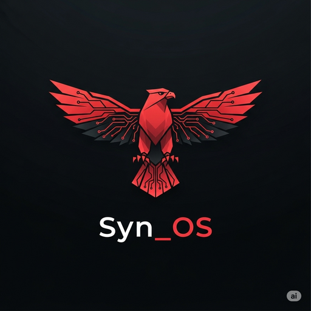
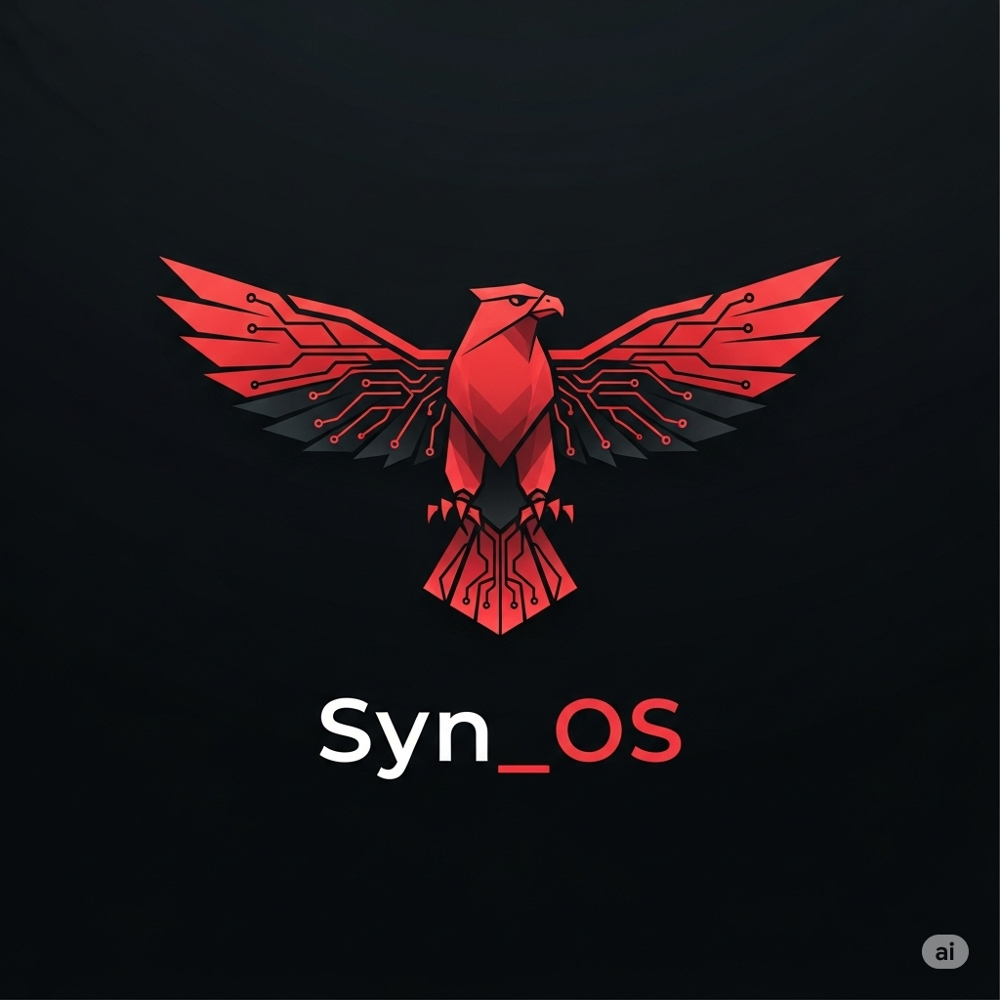

# Syn_OS

### v80.0.0 — "Sunlance" (1.0 GA)

*An AI-native cybersecurity operating system, built almost entirely in Rust, designed for those who treat security as craft.*

---

## the gap

Syn_OS — the **Synaptic Operating System** — takes its name from the *synaptic gap*: the space between neurons where electrical signal becomes meaning. The underscore is deliberate. It points at the moment translation happens — between hardware and intent, between tool and operator, between threat and response.

Syn_OS is built on a different premise than the security-distro lineage that came before: **the operating system itself can carry intelligence.** Not as a chatbot bolted onto the desktop. As a substrate. A kernel that reasons. A daemon that learns the shape of your work. A training environment where every challenge teaches the muscle for the next one.

---

## what's in v80

v80.0.0 "Sunlance" is the **1.0 GA release** — the milestone that closes a sustained, multi-year build.

- **Custom Linux 6.19 kernel** with `CONFIG_RUST=y` and a **capability-gated kernel interface** that lets userspace query AI/observability state — decision telemetry, namespace trust, audit and incident signals, mitigation posture — through signed, memory-safe Rust kernel modules. Access is root-only and capability-gated.
- **209-crate Rust workspace.** Zero compile errors. Memory safety where memory safety matters.
- **ALFRED v6.0** — the AI daemon. Neuroanatomically-modeled brain. Local inference via Ollama and ONNX. No cloud in the critical path.
- **GRIMOIRE 1.0** — the gamified cybersecurity training platform. **108 hand-authored labs across 13 categories.** Faction system. XP economy. Boss contracts. Branching narrative quests. Maps to **11 professional certification paths.** Read more in [GRIMOIRE.md](./GRIMOIRE.md).
- **synos-bevy** — Bevy 0.14 game engine, 8 plugins, ~7,000+ lines of immersive desktop experience.
- **Arcanum Hive** — peer-to-peer encrypted mesh + Kubernetes operator. Sovereign coordination across distributed hardware. **The mesh is built for salvaged silicon** — old laptops and retired workstations pulled out of e-waste and back into the compute pool ([the philosophy →](./MESH.md)).
- **Post-quantum cryptography by default** — hybrid ML-KEM / ML-DSA across the system's transport and signing paths, with SLH-DSA in the trust toolkit.
- **41-stage self-healing build pipeline** producing three signed ISOs from a single source tree.
- **1,600+ tests, 100% pass rate**, 35% tarpaulin coverage floor.
- **MkDocs Material documentation** site, version-aware, checked against the source.

---

## the road to 1.0, in one breath

Syn_OS reached 1.0 GA the way the rest of it was built — by compounding. **Twenty consecutive releases (v61 → v80)** carried the platform from the v60 line to the "Sunlance" general-availability milestone:

- The kernel's AI/observability interface was **re-architected and hardened** — signed modules, capability gates, root-only device access.
- **Post-quantum cryptography became the default**, not an option, across the system's transport and signing surfaces.
- The **GRIMOIRE catalog matured to 1.0** — 108 labs across 13 categories.
- **ALFRED consolidated into v6.0**, with a privacy-first, local-only posture and stronger guardrails around autonomous behavior.
- Supply-chain trust deepened — signed modules enforced, content-pinned packages, build-from-source attestation.

The deeper mechanics of these subsystems live with the source. The shape above is the public picture.

---

## the three-image strategy

Syn_OS is built once and ships in three signed ISOs.

| Image | Audience | What it carries |
|---|---|---|
| **Operator (Master)** | The team that builds Syn_OS. Internal. | The full surface. Not distributed publicly. |
| **GRIMOIRE Public** | Students, cohorts, self-taught practitioners. | The 108-lab training platform, gated tooling, mixed Apache 2.0 + GRIMOIRE-Public license. |
| **Goodlife** | AI researchers, post-quantum experimenters, civilian work. | Jupyter + 10-package research stack, ALFRED `research-mode`, LUKS-encrypted research data. |

The boundaries between images are mechanically enforced — not honor-system. What ships, ships clean.

---

## what we promise

- **The mesh is the product.** Local AI on hardware you physically own. Old silicon reclaimed from landfills, not new GPUs auto-billed monthly. ([the e-waste philosophy →](./MESH.md))
- **No cloud in the critical path.** ALFRED runs on your machine. Inference happens locally. The system does not require a network connection to be useful.
- **No telemetry without consent.** The default state is silent. Anything that crosses the boundary of the box, you approve.
- **Memory-safe by default.** The Rust ratchet (v56) is a one-way commitment — kernel hot paths and userspace foundations move toward Rust, never away.
- **Post-quantum-ready.** Cryptography in the system is being built for the cryptographic transition that's underway, not the one that ended.
- **Reproducible builds.** SLSA-3 reproducible build pipeline. SBOM (CycloneDX) per ISO. Dual-witness signature support across mesh nodes.
- **Sigstore-signed releases.** Cosign-signed ISOs with Rekor transparency log entries. Verifiable provenance from build oracle to your USB stick.
- **Sovereignty as a design property.** You own your infrastructure, your intelligence, your future. Mechanically. Cryptographically. Architecturally.
- **No backdoors. Ever.** The codebase is the codebase.

---

## what's coming

Public release plans (the ISOs that aren't yet distributed publicly):

- **GRIMOIRE Public ISO** — the gamified training platform, signed, downloadable, with first-boot wizard, faction selection, lab progression. Target: imminent.
- **Goodlife ISO** — the AI research variant. Target: imminent.
- **Cohort programs** — multi-tenant GRIMOIRE deployments for classes, clubs, security teams.
- **Public Sigstore + Rekor** — signed releases verifiable against the public transparency log.
- **Hive expansion** — public Ansible playbook for self-hosting the 8-node Arcanum Hive.

The Operator image remains internal. That isn't a deferral. That's the design.

---

## why "Syn_OS"

Three readings, all true:

1. **The synaptic gap.** Where signal becomes meaning. Where the operating system *is* the cleft between hardware and consciousness.
2. **Synthesis.** Hardware + AI + game + mesh, fused into one platform.
3. **Sin / sanity.** A name with weight. A platform with stakes.

> *"Own your infrastructure. Own your intelligence. Own your future."*

---

## who's behind it

Built by a small team out of **LumOs Solutions**, lead by Ty Limoges in pursuit of one question:

**What if security wasn't a checklist — what if it was a way of seeing?**

The work has been sustained over multiple years, across more than sixty named version releases, with a quality bar held high enough that the project's own quality gates (cargo deny clean, 100% test pass, supply-chain provenance, binary boundary enforcement) refuse the build when they aren't met.

---

## stay close

The project is moving fast. The public ISOs are close. Watch this repository — when the chapters change, the documents change with them.

The doors open as the work matures.

---

### *the gap is where the meaning lives.*

— LumOs Solutions —

